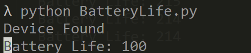

# Corsair-Battery-Life
Simple python script to get the battery life from Corsair Void Pro.

## If the value is 0 initially, your device is probably off. If it is between 0 and 100, that is your battery life currently. If it is above 100, say 170-220, you have your headset muted, and it changes the value, so unmute to check the value of the battery.  

### Just a sidenote:
I had gotten this concept from a blog, but cannot find it, and would like to credit the author for this concept. 
